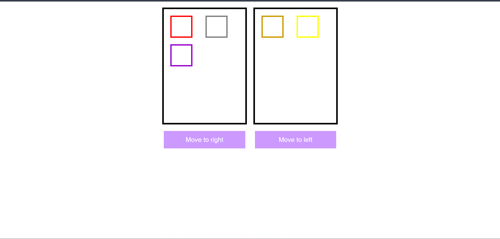
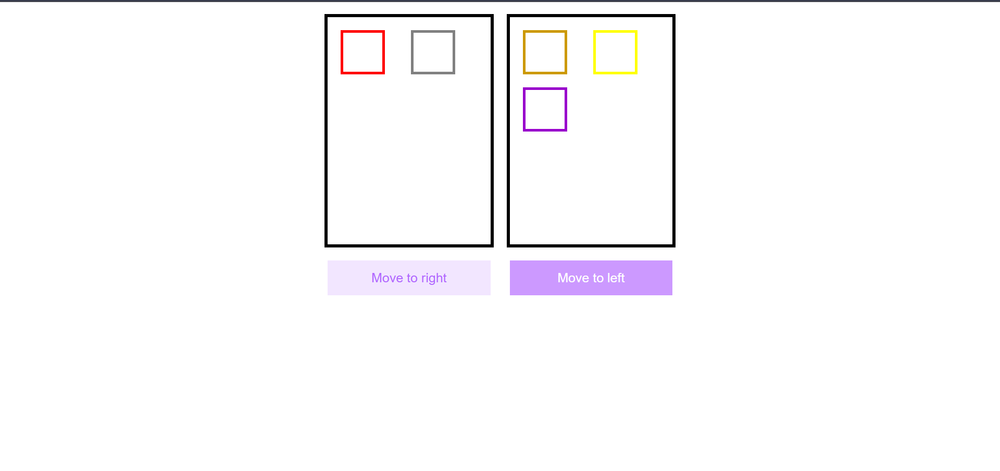
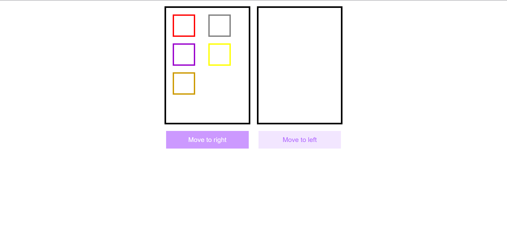
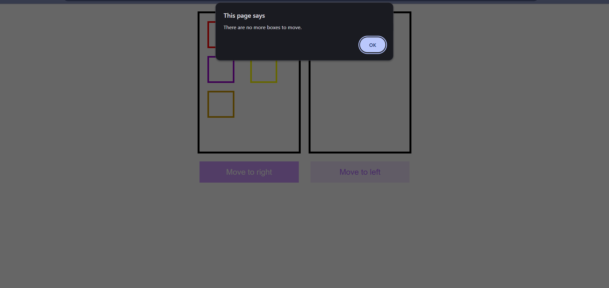

# jQuery Move Divs

A simple interactive project using **HTML, CSS, jQuery**, and **DOM manipulation**.  
Two boxes contain multiple colored child boxes.  
Buttons allow you to move the child boxes from left → right and right → left.

---

##  How It Works

- The first black box contains 3 colored child boxes.
- The second black box contains 2 colored child boxes.
- When you click **"Move to right"**, the last child of the left box moves to the right.
- When you click **"Move to left"**, the last child of the right box moves back to the left.
- If there are no more boxes to move, an alert is shown.

---

##  Files Included

### `index.html`
Contains the structure and buttons, with jQuery CDN included.

### `styles.css`
All styling for layout, buttons, boxes, and borders.

### `script.js`
jQuery logic to move child boxes between the two containers.

---

##  Technologies Used

- HTML5  
- CSS3  
- jQuery 3.7.1  

---

##  How to Run

1. Download or clone the repository.
2. Open `index.html` in any browser.
3. Click the buttons to move the boxes between the two panels.

